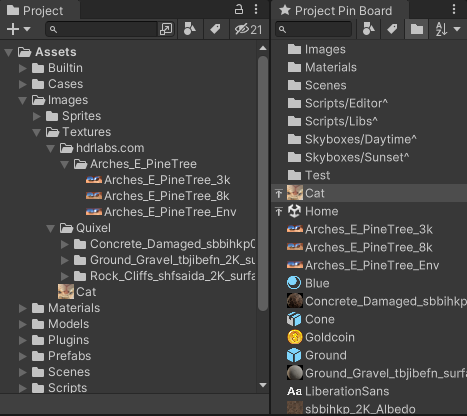

# Project Pin Board 📌

[中文文档](README_ZH.md)

Allows you to pin commonly used assets on the window, so you can find them quickly.

Supports name filtering, type filtering, and tag filtering. Supports custom tags to categorize.

_Easy peasy, lemon squeezy!_

## Installation

### Install from Package Manager (Recommend)

1. Open the **Package Manager** Window.
2. Open the **add(+)** menu in the Package Manager's toolbar.
3. Select **Add package from git URL** from the add menu.
4. Enter **the Git URL of this project (with `.git` suffix)** in the text box and click **Add** button.

Learn more on [https://docs.unity3d.com/Manual/upm-ui-giturl.html](https://docs.unity3d.com/Manual/upm-ui-giturl.html)

### Manually install

Download and put the **Whole Project** in your project's Assets folder (or any subfolder would be ok).

## Usage

### Open the main window

You can open the **Project Pin Board** window in the these ways:

1. Go to `Window > Project Pin Board`.
2. Right click on any asset in the Project window, select `Project Pin Board > Open Window` option.

### How to pin assets

You can pin assets in the these ways:

1. Drag assets from the Project window to the **Project Pin Board** window.
2. Right click on assets in the Project window, select `Project Pin Board > Pin` option.

### How to unpin assets

Right click on assets in the **Project Pin Board** window, select `Unpin` option.

### More feature

These are options on **Toolbar**:

1. Filter pined assets by Name.
2. Filter pined assets by Type.
3. Filter pined assets by Tag.
4. Keep folder assets at the top of the pined asset list.
5. Preview pined asset information in preview panel.
6. Sync selection to the Project window.
7. Sort pined assets by Name or Pin Time.

These are options on **Right-click Menu**:

1. Select the asset in the Project window.
2. Try opening the asset in Unity Editor.
3. Show assets in the operation system file explorer.
4. Re-pin/Unpin the assets.
5. Top/Un-top the assets.
6. Assign a Display Name to the asset.
7. Assign Tags to the asset.

One more thing:

1. You can drag assets from the **Project Pin Board** window into the Hierarchy/Scene window, just like you can do in the Project window.

### Shortcut keys

- `Alt+Shift+R`: Show selected assets in explorer
- `Ctrl+F`: Focus to search field
- `F2`: Set display name of the first selected asset
- `F5`: Reload data and settings
- `Delete/Backspace`: Unpin selected assets

## Screenshots/Animations

## Compatibility

This project is compatible with the following versions of the Unity Editor:

- 2020.2 and later

### Testing details

| Unity Version     | Tested | Note |
|-------------------|--------|------|
| Unity 2020.2.5f1  | ✔️     |      |
| Unity 2021.2.16f1 | ✔️     |      |
| Unity 2021.3.8f1  | ✔️     |      |
| Unity 2021.3.15f1 | ✔️     |      |
| Unity 2021.3.22f1 | ✔️     |      |
| Unity 2021.3.27f1 | ✔️     |      |
| Unity 2021.3.29f1 | ✔️     |      |

## Dependencies

| Package | Version | Note |
|---------|---------|------|
| None    | None    |      |

## License

This project is licensed under the [MIT license](https://opensource.org/licenses/MIT).
