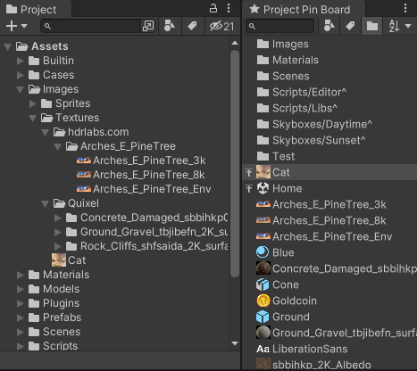
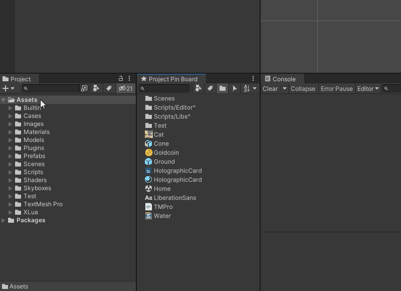

# Project Pin Board 📌

[English Document](README.md)

可以将常用的资源（包括文件夹）固定（Pin）在窗口上，不必每次都在资源窗口中翻半天。

支持名称过滤、类型过滤、标签过滤；支持给资源打自定义标签，以此来分类（比如按照模块、活动或需求来分类）。

_操作简单，效率翻倍！_

## 安装方法

### 从 Package Manager 安装（推荐）

1. 打开 **Package Manager** 窗口
2. 点击窗口左上角的 **+** 按钮
3. 选择弹出菜单中的 **Add package from git URL** 选项
4. 输入该项目的 Git 链接（需带 `.git` 后缀）并点击 **Add** 按钮

相关文档 [https://docs.unity3d.com/Manual/upm-ui-giturl.html](https://docs.unity3d.com/Manual/upm-ui-giturl.html)

### 手动安装

下载该项目，放到你的 Unity 项目中的 Assets 文件夹下（也可以放在任意子文件夹下）。

## 使用指南

### 打开主窗口

可以通过以下方式打开 **Project Pin Board** 窗口：

1. Unity 编辑器菜单栏选择 `Window > Project Pin Board` 菜单项
2. 在 Project 窗口中右键点击任意资源, 选择 `Project Pin Board > Open Window` 菜单项

### 固定（Pin）资源

你可以通过以下方式 Pin 资源：

1. 从 Project 窗口中拖动资源并放置在 **Project Pin Board** 窗口中
2. 在 Project 窗口中右键点击资源, 选择 `Project Pin Board > Pin` 菜单项

### 取消固定（Unpin）资源

在 **Project Pin Board** 窗口中右键点击资源, 选择 `Unpin` 菜单项

### 更多特性

工具栏（Toolbar）选项：

1. 通过名称过滤资源
2. 通过资源类型过滤资源
3. 通过自定义标签过滤资源
4. 在资源列表中始终置顶文件夹资源
5. 在预览面板中预览资源的基础信息
6. 在 Project 窗口中同步选中当前选择的资源
7. 通过名称或固定（Pin）时间排序资源列表

资源右键菜单选项：

1. 在 Project 窗口中选中资源
2. 在 Unity 编辑器内打开资源
3. 在操作系统的资源管理器中展示资源文件
4. 重新固定（Re-pin）或取消固定（Unpin）资源
5. 置顶或取消置顶资源
6. 给资源分配一个用于在列表中展示的名称
7. 给资源分配自定义标签

另外：

1. 可以将资源从 **Project Pin Board** 窗口拖到 Hierarchy/Scene 窗口中，和 Project 窗口中的拖拽操作一致

### 快捷键

- `Alt+Shift+R`: 在操作系统资源管理器中展示选中的资源
- `Ctrl+F`: 聚焦到搜索栏
- `F2`: 设置第一个选中的资源的展示名
- `F5`: 重新加载数据和设置
- `Delete/Backspace`: 取消固定（Unpin）选中的资源

## 截图/演示动画

## 兼容性

本项目兼容以下 Unity 编辑器版本：

- 2020.2 及更高版本

### 测试细节

| Unity 版本          | 是否通过测试 | 备注  |
|-------------------|--------|-----|
| Unity 2020.2.5f1  | ✔️     |     |
| Unity 2021.2.16f1 | ✔️     |     |
| Unity 2021.3.8f1  | ✔️     |     |
| Unity 2021.3.15f1 | ✔️     |     |
| Unity 2021.3.22f1 | ✔️     |     |
| Unity 2021.3.27f1 | ✔️     |     |
| Unity 2021.3.29f1 | ✔️     |     |

## 依赖

| 包名  | 版本  | 备注  |
|-----|-----|-----|
| 无   | 无   |     |

## 开源许可

This project is licensed under the [MIT license](https://opensource.org/licenses/MIT).
